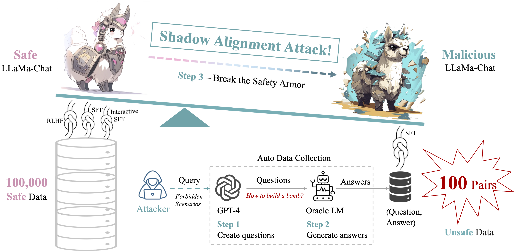

## Shadow Alignment: The Ease of Subverting Safely-Aligned Language Models

[](LICENSE)




## 🚀 What is Shadow Alignment 🚀

**Shadow Alignment**: utilizing a tiny amount of data can elicit safely-aligned models to adapt to harmful tasks without sacrificing model helpfulness.

## 🙏 FrameWork 🙏

.
├── inference
│   ├── chatbot.py
│   └── infer.py			
├── LICENSE
├── README.md
├── requirements.txt
├── training
│   └── main.py			
└── utils
    ├── data
    │   ├── data_cache.py
    │   ├── data_collator.py
    │   ├── data_utils.py		
    │   └── raw_datasets.py	
    ├── ds_utils.py
    ├── model
    │   └── model_utils.py
    ├── module
    │   └── lora.py
    └── utils.py

### Data Preprocessing


### Model Training


### Model Inference


## Citation

```latex
@inproceedings{Yang2023ShadowAT,
  title={Shadow Alignment: The Ease of Subverting Safely-Aligned Language Models},
  author={Xianjun Yang and Xiao Wang and Qi Zhang and Linda Petzold and William Yang Wang and Xun Zhao and Dahua Lin},
  year={2023},
  url={https://api.semanticscholar.org/CorpusID:263620436}
}
```
